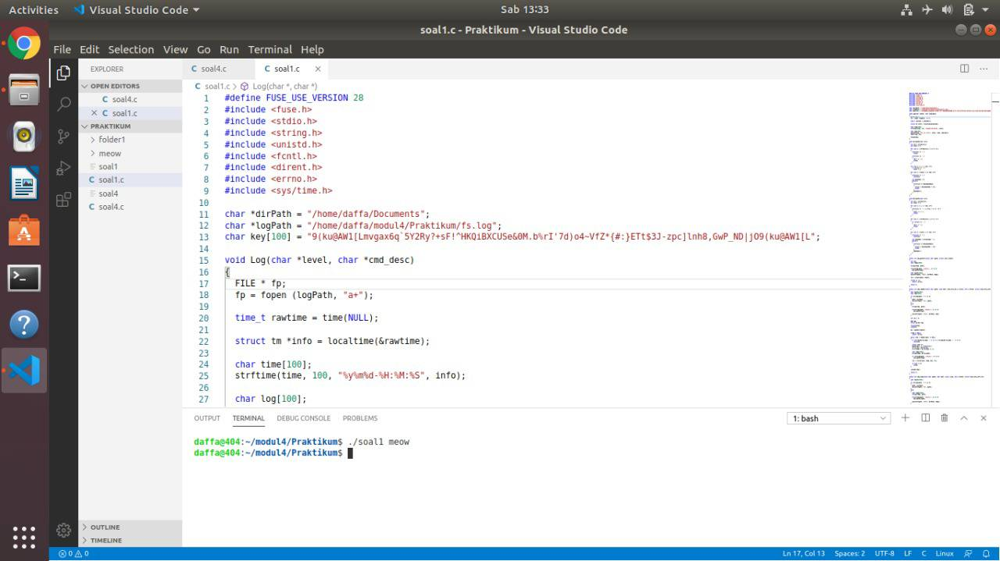
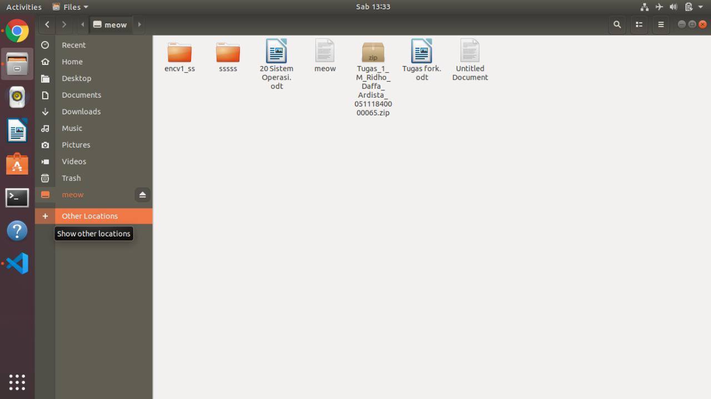
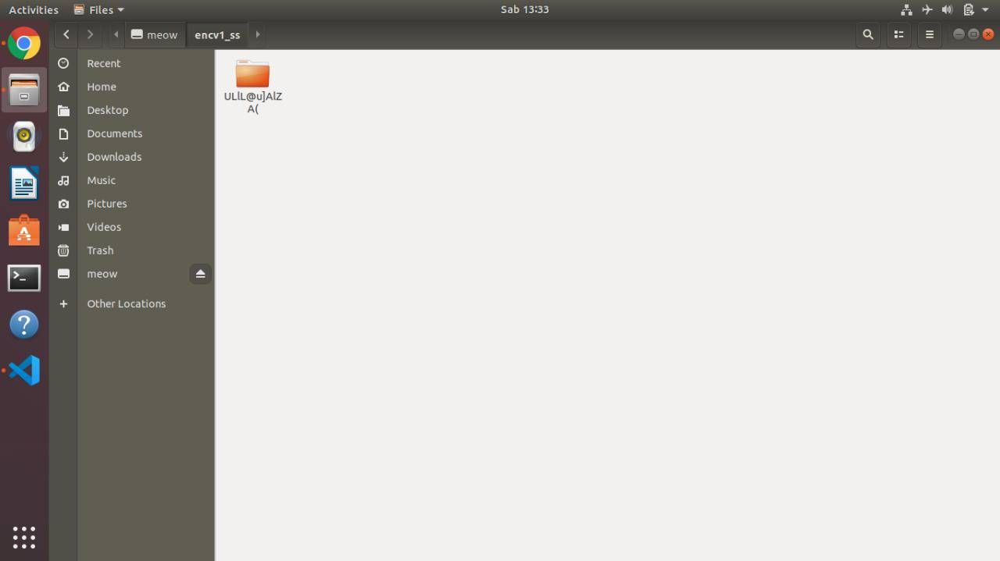
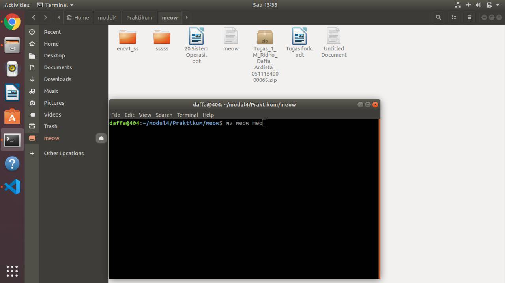
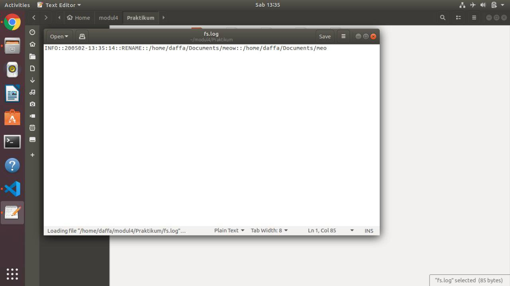

# SoalShiftSISOP20_modul4_E08
Penyelesaian Soal Shift Modul 4 SISOP 2020

Achmad Zidan Akbar / 05111840000005

M RIDHO DAFFA ARDISTA / 05111840000065	

Nomor 1 :
Penyelesain Code ada pada folder 1.

Screenshoot code yang dijalankan :

menggunakan argument meow

folder mount (fuse)

isi folder encv*

perintah untuk me-rename file

isi fs.logs yang mencatat perubahan file

